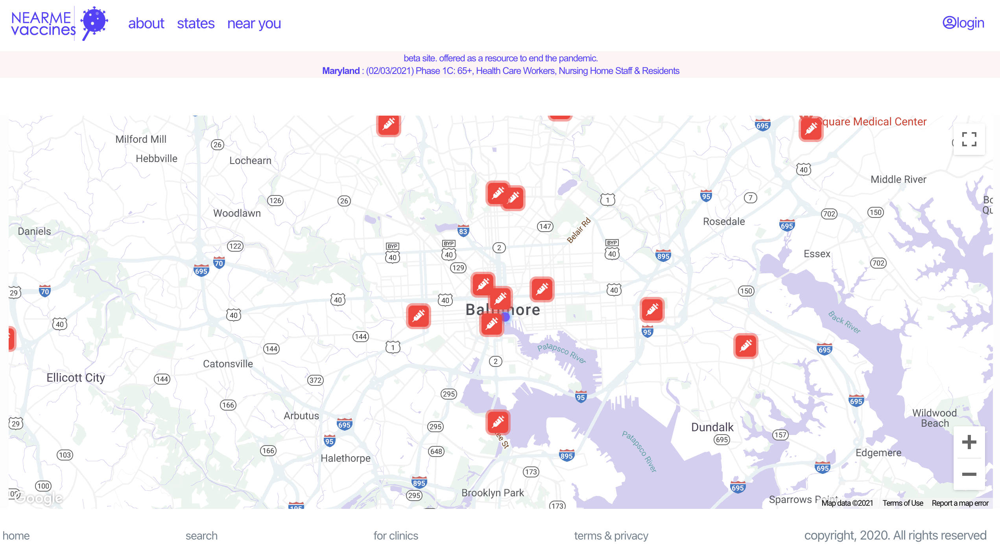

# Near-Me-Vaccines
a React.js project to help U.S.-based humans find their local vaccination informtion.

## Architecture
*   Built using react.js
*   Utilizes graphQL through Amazon AWS DynamoDB. PUT, GET, DELETE
*   Developed for mobile first with search by first name and sort-by column onClick.
*   Form Validation utilizing Formik.
*   Utilizes Moment.js to convert ISO string to a user-friendly format for the ser, including 24 hr string to AM/PM.
*   Google API for geolocation, javascript maps.

## Credits
*   Built using Bootstrap for React.js.
*   Utilizing random employee generator provided by [randomuser.me](https://randomuser.me/api/)
*   Built using React.js

## Functionality
### Landing Page
*   landing page provides multiple methods for the user to find relevant information. On the header, the API automatically utilizes IP Address search > State >searches State DynamoDB & places relevant information.
Desktop View | Mobile View
------------ | -------------
 | 

### Geolocation Service
*   If the user shares their location within their browser, the application utilizes their lat & long > builds the map. If the user does not share, they're given a reason then advised to visit the general state map.
Desktop View | Mobile View
------------ | -------------
 | 

### Front-End Map Interaction from User.
*   User can click on map location pin to view specific details, contact information, and linking info.

Desktop View | Mobile View
------------ | -------------
 | 
### General State Information with Progress Bar.
*   The state update form enables the webmaster to assign the current status of the vaccination.
*   The location information is dynamic, which includes a timestamp so the end-user can see when it was previously updated.
*   State information is derrived from the URL then filled.
Desktop View | Mobile View
------------ | -------------
 | 

### Adding State Vaccination Locations
*   The webmaster or user can add locations, set hours, provide website address, and contact information.
    *   utilizes Geolocation to create Lat & Long coordinates for the business listings & awaits a response.
*   The webmaster can update, delete location information.

